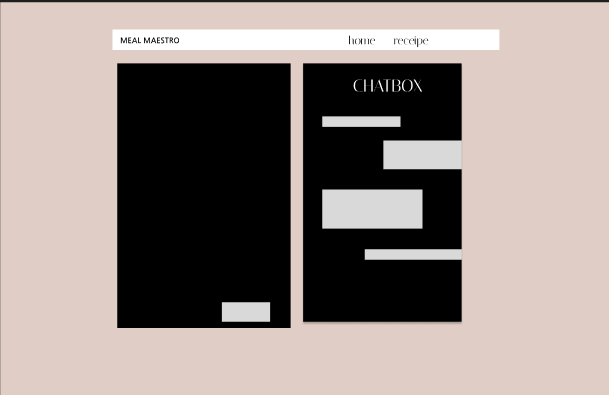
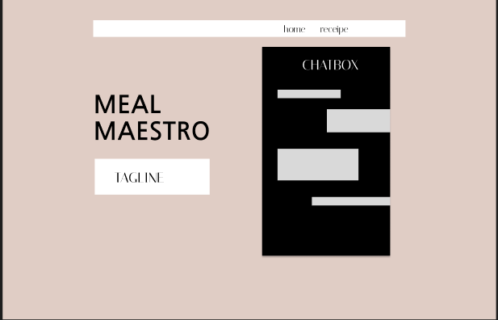

# MealMaestros

MealMaestros is a personalized meal-planning web application designed to cater to diverse dietary preferences, health goals, and regional tastes. This platform allows users to customize their meal plans according to specific preferences and provides various tools to enhance the meal-planning experience, from calorie tracking to ingredient identification.

## Table of Contents
1. [Features](#features)
2. [Tech Stack](#tech-stack)
3. [UI/UX Plan](#uiux-plan)
4. [Getting Started](#getting-started)
5. [Installation](#installation)
6. [Usage](#usage)
7. [Future Enhancements](#future-enhancements)
8. [Contributors](#contributors)
9. [License](#license)

## Features
MealMaestros offers the following key functionalities:

### 1. **User Account Management**
   - **Login & Signup**: Users must sign up or log in to access the application's features. User authentication is securely managed and backed by MongoDB Atlas, ensuring reliable data storage and retrieval.

### 2. **Home Page**
   - **Overview of MealMaestros**: The home page provides an introduction to the platform's purpose, highlighting the use cases and its main features.
   - **Meet the Makers**: Learn about the team behind MealMaestros, known as StrawHatters.
   - **Primary Feature Navigation**: A prominent button directs users to the meal preferences section, where they can start customizing their meal plans.

### 3. **Meal Preferences Customization**
   - **Region**: Select a preferred region to customize meals with regional flavors (e.g., North Indian, Mediterranean).
   - **Dietary Preferences**: Choose between dietary preferences such as vegetarian, vegan, etc.
   - **Health Goals**: Define health objectives (e.g., weight loss, muscle gain).
   - **Meal Frequency**: Specify the number of meals per day.
   - **Calorie Intake Limit**: Set a daily calorie limit.
   - **Allergies**: Indicate specific allergies to avoid incompatible ingredients.
   - **Plan Duration**: Decide the duration of the meal plan.
   
   After preferences are set, the chatbot generates a meal plan tailored to the user’s specifications.

### 4. **Additional Tools**
   - **Calorie Counter**: Check the calorie content of specific ingredients.
   - **Recipe Finder**: Search for detailed recipes with step-by-step instructions.
   - **Ingredient Finder (Image AI)**: Use image-based search to identify ingredients and get relevant images.
   - **Predefined Prompts**: Quick-start options for commonly used preferences, such as vegetarian and region-specific meal plans (e.g., North Indian vegetarian).

---

## 🛠 **Tech Stack**

- **Frontend**: Streamlit, offering a seamless and engaging user interface for responsive and user-friendly interactions.
- **Data Management**: MongoDB Atlas, a scalable and flexible cloud database to manage user accounts and meal data efficiently.
- **APIs**: Gemini API integration to support the interactive chatbot and provide an enhanced, AI-driven user experience.
- **Developer Tools**: GitHub Copilot Student Pack, used to enhance development efficiency with AI-powered code suggestions and tools.

---

## 🌐 **UI/UX Plan**

Below are initial wireframes and UI concepts to illustrate the layout and flow of MealMaestros:





---

## Getting Started
To start using MealMaestros, sign up or log in. The account management system uses MongoDB Atlas, so a connection to the database is required. Once authenticated, navigate through the home page to access the meal preference settings and other features.

## Installation
To run MealMaestros locally, follow these steps:

1. **Clone the repository**:
   ```bash
   git clone https://github.com/yourusername/mealmaestros.git
   cd mealmaestros
   ```


## Usage
Once logged in, users can explore various features of MealMaestros:

1. **Navigate to Home Page**: Read about the platform and the team.
2. **Customize Meal Preferences**: Define your preferences and get a personalized meal plan from the chatbot.
3. **Use Additional Tools**:
   - **Calorie Counter**: Check the calorie content of individual ingredients.
   - **Recipe Finder**: Get detailed recipes with easy-to-follow steps.
   - **Ingredient Finder (Image AI)**: Visual search tool to identify ingredients through images.

## Future Enhancements
MealMaestros is constantly evolving. Planned features include:

- **Enhanced Region-Specific Options**: More in-depth meal options for various regions.
- **Interactive Chatbot**: Improved conversational abilities for the chatbot to handle complex queries and provide more personalized responses.
- **Calendar Integration**: Set reminders and add meal plans directly to your calendar for timely notifications.

## Contributors
- **StrawHatters** - The passionate team behind MealMaestros. Connect with us for feedback, feature requests, or collaboration.

## License


---

This README now includes the **GitHub Copilot Student Pack** as part of the Tech Stack, emphasizing its role in accelerating development.